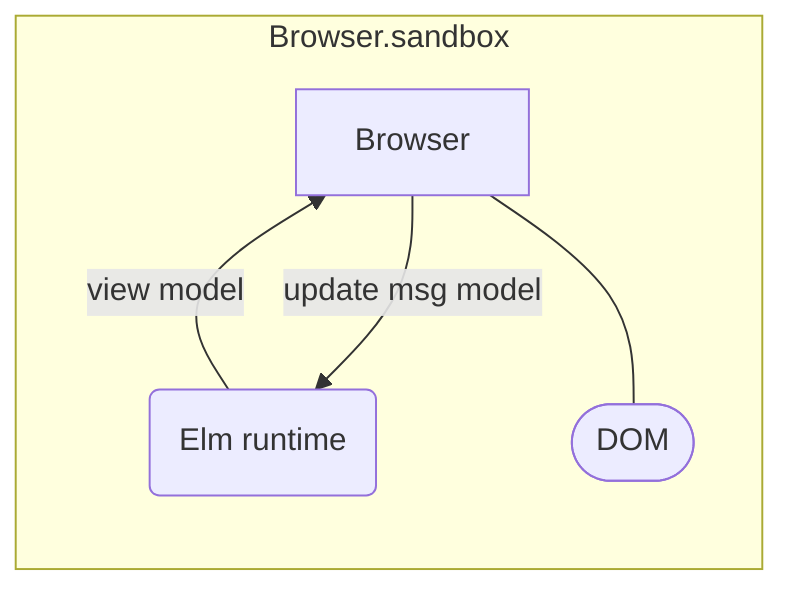
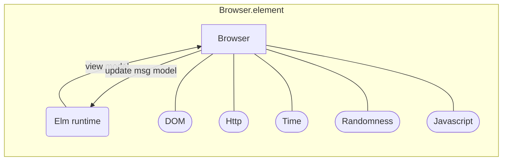

# The origin of Redux

Introduction to Elm Architecture

<carbon-link /> [enolive.github.io/intro-to-elm-architecture](https://enolive.github.io/intro-to-elm-architecture/slides)

<my-v-card />

---
layout: banner
main: Elm
sub: Core Language
---

---

<div class="fade">

<v-clicks>

- since 2012 (current version 0.19.1)
- purely functional
- static typed
- syntax similar to Haskell
- single purpose language for Frontend Development
- inspiration for Redux

</v-clicks>

</div>

---

# Ecosystem

| Tool       | Description                       |
|------------|-----------------------------------|
| elm        | compiler                          |
| elm-format | opinionated formatter             |
| elm-test   | testing framework                 |
| elm-live   | better dev server with hot reload |

install by `npm i <package> -g`

---

# Example

```elm
isEven : Int -> Bool
isEven x = remainderBy 2 x == 0

pow2 : Int -> Int
pow2 x = x * x

List.range 1 10 
  |> List.filter isEven 
  |> List.map pow2
-- [4, 16, 36, 64, 100]
```

---
layout: image
image: https://source.unsplash.com/random?coding
---

# Simple Elm Frontend App

<style>
  h1 {
    @apply text-shadow-xl;
  }
</style>

---
layout: banner
main: Elm
sub: Architecture
---

---

# How to mutate state?

```elm
counter = counter + 1
```

<v-click>


<carbon-arrow-right /> Does not compile!


```log
The `counter` value is defined directly in terms of itself, causing an infinite
loop.

Are you are trying to mutate a variable? Elm does not have mutation, so when I
see counter defined in terms of counter, I treat it as a recursive definition.
Try giving the new value a new name!
```

</v-click>

---

# Functional approach

```elm
type alias Model = Int

inc : Model -> Model
inc counter = counter + 1
```

<v-click>

```elm
type alias Model = { counter : Int }
type Msg = Increment

update : Msg -> Model -> Model
update msg model =
  case msg of
    Increment -> { model | counter = model.counter + 1 }
```

</v-click>

---
layout: two-cols
---

# Minmial Stateful App



::right::

<v-click>

```elm
main = Browser.sandbox 
  { init = init, view = view, update = update }

type alias Model = ...
type Msg = ...

init : Model
...
view : Model -> Html Msg
...
update : Msg -> Model -> Model
...
```

</v-click>

---
layout: image
image: https://source.unsplash.com/random?coding
---

# Stateful Demo

<style>
  h1 {
    @apply text-shadow-xl;
  }
</style>

---
layout: banner
main: What about
sub: Side Effects?
---
---

# Commands and Subscriptions

<v-clicks>

- Cmd : trigger an effect
  - Http
  - Random
- Sub : subscribe to an effect from the outside world
  - Time
  - Ports

</v-clicks>

---
layout: two-cols
---

# Minmial Effectful App



::right::

<v-click>

```elm
main = Browser.element 
  { 
    init = init, 
    view = view, 
    update = update, 
    subscriptions = subscriptions 
  }

type alias Model = ...
type Msg = ...

init : () -> (Model, Cmd)
...
view : Model -> Html Msg
...
update : Msg -> Model -> (Model, Cmd)
...

subscriptions : Sub
subscriptions = Sub.none
```

</v-click>

---
layout: image
image: https://source.unsplash.com/random?coding
---

# Effectful Demo

<style>
  h1 {
    @apply text-shadow-xl;
  }
</style>

---
layout: banner
main: Conclusion
sub: IMHO
---

---
layout: cover
class: text-3xl
---

# Elm is a good intro to

<div class="fade">

<v-clicks>

- pure functional programming
- functional state management
- Model View Update architectures

</v-clicks>

</div>

<style>
  h1 {
    @apply !text-4xl;
  }
</style>

---
layout: cover
class: text-3xl
---

# Elm is not

<div class="fade">

<v-clicks>

- The best programming language
- The best way to develop frontend apps
- The silver bullet architecture for state management concerns

</v-clicks>

</div>

<style>
  h1 {
    @apply !text-4xl;
  }
</style>

---

# More resources

- <carbon-link /> [Elm Guide](https://guide.elm-lang.org/)
- <carbon-link /> [Web Apps in Elm](https://guide.elm-lang.org/webapps/)
- <carbon-link /> [Javascript Interop](https://guide.elm-lang.org/interop/)
- Component testing with <carbon-link /> [elms-program-test](https://elm-program-test.netlify.app/)