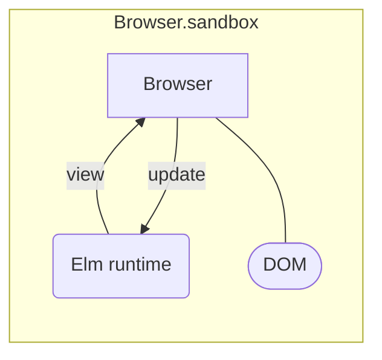
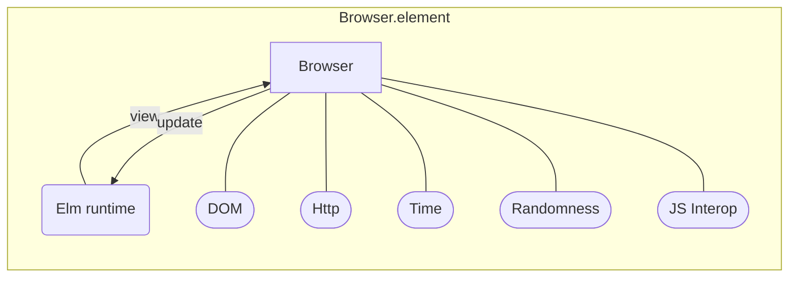

# The origin of Redux

Introduction to Elm Architecture

<carbon-link /> [enolive.github.io/intro-to-elm-architecture](https://enolive.github.io/intro-to-elm-architecture)

<my-v-card />

---
layout: banner
main: Elm
sub: Core Language
---

---
class: text-3xl
---

# Quick Facts

<div class="fade">

<v-clicks>

- since 2012 (current version 0.19.1)
- purely functional, static typed language
- syntax similar to Haskell, but easier
- single purpose language for Frontend Development
- inspiration for Redux

</v-clicks>

</div>

<style>
  h1 {
    @apply !text-2xl
  }
</style>

---

# Ecosystem

|            |                                               |
|------------|-----------------------------------------------|
| elm        | compiler                                      |
| elm-format | opinionated formatter                         |
| elm-test   | testing framework for examples and properties |
| elm-live   | better dev server with hot reload             |

install by `npm i <tool> -g`

---

# Example

```elm
isEven : Int -> Bool
isEven x = remainderBy 2 x == 0

pow2 : Int -> Int
pow2 x = x^2

List.range 1 10 
  |> List.filter isEven 
  |> List.map pow2
-- [4, 16, 36, 64, 100]
```

---
layout: image
image: https://source.unsplash.com/random?coding
---

# Simple Elm Frontend App

<style>
  h1 {
    @apply text-shadow-xl;
  }
</style>

---
layout: banner
main: Elm
sub: Architecture
---

---

# How to mutate state?

```elm
counter = counter + 1
```

<v-click>

<carbon-arrow-right /> Does not compile!

> ...
> 
> The `counter` value is defined directly in terms of itself, 
> causing an infinite
> loop.
> 
> Are you are trying to mutate a variable? Elm does not have mutation, so when I
> see counter defined in terms of counter, I treat it as a recursive definition.
> Try giving the new value a new name!
>
> ...

</v-click>

---

# Functional approach

```elm
type alias Model = Int

inc : Model -> Model
inc counter = counter + 1
```

<v-click>

more generic version

```elm
type alias Model = { counter : Int }
type Msg = Increment

update : Msg -> Model -> Model
update msg model =
  case msg of
    Increment -> { model | counter = model.counter + 1 }
```

</v-click>

---
layout: two-cols
---

# Minmial Stateful App



::right::

<v-click>

```elm
main = Browser.sandbox 
  { init = init, view = view, update = update }

type alias Model = ...
type Msg = ...

init : Model
...
view : Model -> Html Msg
...
update : Msg -> Model -> Model
...
```

</v-click>

---
layout: image
image: https://source.unsplash.com/random?coding
---

# Stateful Demo

<style>
  h1 {
    @apply text-shadow-xl;
  }
</style>

---
layout: banner
main: What about
sub: Side Effects?
---
---

# Commands and Subscriptions

<v-clicks>

- *Cmd* : command Elm to do an effectful operation
  - Http
  - Random
- *Sub* : subscribe to an effect from the outside world
  - Time
  - Ports

</v-clicks>

---
layout: two-cols
---

# Minmial Effectful App



::right::

<v-click>

```elm
main = Browser.element 
  { 
    init = init, 
    view = view, 
    update = update, 
    subscriptions = subscriptions 
  }

type alias Model = ...
type Msg = ...

init : () -> (Model, Cmd Msg)
...
view : Model -> Html Msg
...
update : Msg -> Model -> (Model, Cmd Msg)
...

subscriptions : Model -> Sub Msg
...
```

</v-click>

---
layout: image
image: https://source.unsplash.com/random?coding
---

# Effectful Demo

<style>
  h1 {
    @apply text-shadow-xl;
  }
</style>

---
layout: banner
main: Conclusion
sub: IMHO
---

---
layout: cover
class: text-3xl
---

# Elm is a good intro to

<div class="fade">

<v-clicks>

- pure functional programming
- functional frontend apps
- Model View Update architecture

</v-clicks>

</div>

<style>
  h1 {
    @apply !text-4xl;
  }
</style>

---
layout: cover
class: text-3xl
---

# Elm is not the

<div class="fade">

<v-clicks>

- best programming language
- best way to develop frontend apps
- silver bullet architecture for state management concerns

</v-clicks>

</div>

<style>
  h1 {
    @apply !text-4xl;
  }
</style>

---
layout: cover
---

# 💗 for joining me!

- <carbon-link /> [enolive.github.io/intro-to-elm-architecture](https://enolive.github.io/intro-to-elm-architecture)
- <carbon-link /> [Elm Guide](https://guide.elm-lang.org/)
- <carbon-link /> [Web Apps in Elm](https://guide.elm-lang.org/webapps/)
- <carbon-link /> [Javascript Interop](https://guide.elm-lang.org/interop/)
- <carbon-link /> Component testing with [elms-program-test](https://elm-program-test.netlify.app/)

<my-v-card />

<style>
  li {
    @apply !list-none m-0
  }
</style>